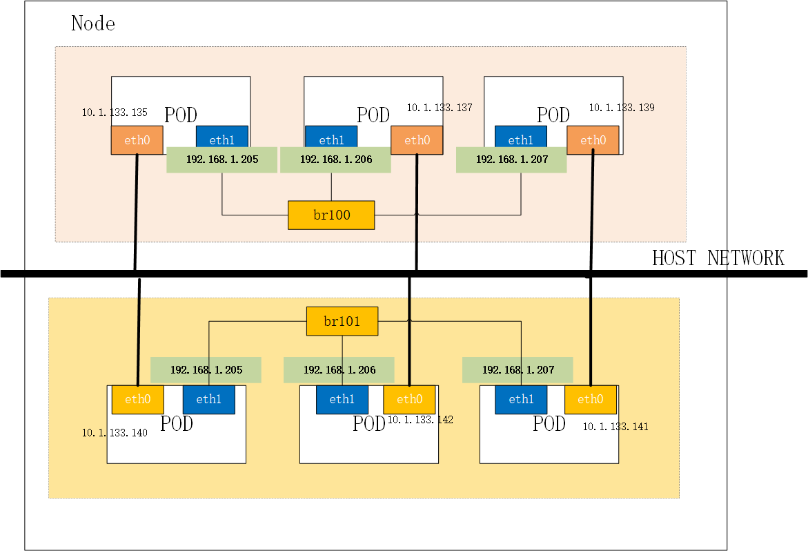

# 在一个k8s集群中构建多个具有相同IP范围的子网

思路：在一个k8s集群中要构建多个子网，且各个子网的IP范围相同，需要借助multus-cni构建多网络平面的技术，

此处构建多个brige类型的网络，设定相同的IP范围，各子网内可以互通，子网间不能通过子网IP互通，但可以通过公共IP互通



以下仅记录操作过程：

1. 准备工作
```
microk8s 安装 kubernetes & multus
参考： https://www.1024sou.com/article/142597.html

安装docker
yum install docker -y
systemctl start docker
systemctl enable docker 
systemctl status docker 

安装snap 
参考 https://snapcraft.io/docs/installing-snap-on-centos
yum install snapd
systemctl enable --now snapd.socket
ln -s /var/lib/snapd/snap /snap

安装microk8s
# snap info microk8s
# snap install microk8s --classic --channel=latest/beta
microk8s (beta) v1.23.4 from Canonical✓ installed

因国内网络问题，预先设置好所需要镜像
# cat import.sh 
#!/bin/bash

images=(
k8s.gcr.io/metrics-server/metrics-server:v0.5.2=cnskylee/metrics-server:v0.5.0
k8s.gcr.io/ingress-nginx/controller:v1.1.0=jixiangjiangshu/ingress-controller:v1.1.1
k8s.gcr.io/pause:3.1=mirrorgooglecontainers/pause:3.1
docker.io/kubernetesui/dashboard:v2.0.0=docker.io/kubernetesui/dashboard:v2.0.0
kubernetesui/dashboard:v2.0.0=docker.io/kubernetesui/dashboard:v2.0.0
docker.io/kubernetesui/metrics-scraper:v1.0.4=docker.io/kubernetesui/metrics-scraper:v1.0.4
docker.io/cdkbot/addon-resizer-amd64:1.8.1=docker.io/cdkbot/addon-resizer-amd64:1.8.1
docker.io/coredns/coredns:1.6.6=docker.io/coredns/coredns:1.6.6
)
OIFS=$IFS; # 保存旧值
for image in ${images[@]};do
    IFS='='
    set $image
    docker pull $2
    docker tag  $2 $1
#    docker rmi  $2
    docker save $1 > 1.tar && microk8s.ctr i import 1.tar && rm 1.tar
    IFS=$OIFS; # 还原旧值
done

# ./import.sh 

# microk8s stop
# microk8s start

# microk8s enable dns
# microk8s enable ha-cluster

# microk8s kubectl get pod -A
```

2. 安装multus
```
# microk8s enable multus
……
New CNI plugins can be installed in /var/snap/microk8s/current/opt/cni/bin/
……

# ll /var/snap/microk8s/current/opt/cni/bin/
total 284332
-rwxr-xr-x 1 root root  3990548 Mar 17 20:50 bandwidth
-rwxr-xr-x 1 root root  4665324 Mar 17 14:11 bridge
-rwsr-xr-x 1 root root 47026188 Mar 17 20:50 calico
-rwsr-xr-x 1 root root 47026188 Mar 17 20:50 calico-ipam
-rwxr-xr-x 1 root root 12473958 Mar 17 14:11 dhcp
-rwxr-xr-x 1 root root  6009109 Mar 17 14:11 firewall
-rwxr-xr-x 1 root root  3357992 Mar 17 20:50 flannel
-rwxr-xr-x 1 root root 35249016 Mar 17 14:11 flanneld
-rwxr-xr-x 1 root root  4282031 Mar 17 14:11 host-device
-rwxr-xr-x 1 root root  3402808 Mar 17 20:50 host-local
-rwsr-xr-x 1 root root 47026188 Mar 17 20:50 install
-rwxr-xr-x 1 root root  4413815 Mar 17 14:11 ipvlan
-rwxr-xr-x 1 root root  3472123 Mar 17 20:50 loopback
-rwxr-xr-x 1 root root  4497003 Mar 17 14:11 macvlan
-rwxr-xr-x 1 root root 36115148 Mar 17 21:29 multus
-rwxr-xr-x 1 root root  3924908 Mar 17 20:50 portmap
-rwxr-xr-x 1 root root  4596578 Mar 17 14:11 ptp
-rwxr-xr-x 1 root root  3732576 Mar 17 14:11 sbr
-rwxr-xr-x 1 root root  3248583 Mar 17 14:11 static
-rw-r--r-- 1 root root  4555575 Mar 17 20:50 tags.txt
-rwxr-xr-x 1 root root  3622648 Mar 17 20:50 tuning
-rwxr-xr-x 1 root root  4413663 Mar 17 14:11 vlan

# microk8s kubectl get pods -n kube-system --selector=app=multus
NAME                         READY   STATUS    RESTARTS   AGE
kube-multus-ds-amd64-mdfm7   1/1     Running   0          81s

# snap alias microk8s.kubectl kubectl
```

3. 子网固定IP验证
```
定义子网
# cat subnet.yaml 
apiVersion: "k8s.cni.cncf.io/v1"
kind: NetworkAttachmentDefinition
metadata:
  name: home-network
spec:
  config: '{
    "cniVersion": "0.3.1",
    "name": "home-network",
    "type": "bridge",
    "bridge": "br100",
    "isDefaultGateway": false,
    "forceAddress": false,
    "ipMasq": false,
    "hairpinMode": false,
    "ipam": {
      "type": "host-local",
      "subnet": "192.168.1.0/24",
      "rangeStart": "192.168.1.201",
      "rangeEnd": "192.168.1.250",
      "routes": [
        { "dst": "0.0.0.0/0" }
      ],
      "gateway": "192.168.1.1"
    }
  }'

# kubectl apply -f subnet.yaml 
networkattachmentdefinition.k8s.cni.cncf.io/home-network created

# cat subnet1.yaml 
apiVersion: "k8s.cni.cncf.io/v1"
kind: NetworkAttachmentDefinition
metadata:
  name: home-network1
spec:
  config: '{
    "cniVersion": "0.3.1",
    "name": "home-network1",
    "type": "bridge",
    "bridge": "br101",           #注：名称任意，但必须唯一
    "isDefaultGateway": false,
    "forceAddress": false,
    "ipMasq": false,
    "hairpinMode": false,
    "ipam": {
      "type": "host-local",
      "subnet": "192.168.1.0/24",
      "rangeStart": "192.168.1.201",
      "rangeEnd": "192.168.1.250",
      "routes": [
        { "dst": "0.0.0.0/0" }
      ],
      "gateway": "192.168.1.1"
    }
  }'

# kubectl apply -f subnet1.yaml 
networkattachmentdefinition.k8s.cni.cncf.io/home-network1 created

# kubectl get network-attachment-definitions
NAME            AGE
home-network    25s
home-network1   18s

创建pod
# cat pod.yaml 
---
apiVersion: v1
kind: Pod
metadata:
  labels:
    app: multus-alpine
  name: multus-alpine
  namespace: default
  annotations:
    k8s.v1.cni.cncf.io/networks: '[
      {
         "name" : "home-network",
         "interface": "eth1",
         "ips": ["192.168.1.205"]
      }
    ]'
spec:
  containers:
    - name: multus-alpine
      image: alpine:latest
      command: ["sh"]
      args: ["-c", "while [ true ]; do ifconfig; sleep 3; done"]
  restartPolicy: Always
  
# kubectl apply  -f pod.yaml 
pod/multus-alpine created

# kubectl exec -it multus-alpine -- ip a
……
5: eth1@if17: <BROADCAST,MULTICAST,UP,LOWER_UP,M-DOWN> mtu 1500 qdisc noqueue state UP 
    link/ether 52:44:ac:f2:df:77 brd ff:ff:ff:ff:ff:ff
    inet 192.168.1.205/24 brd 192.168.1.255 scope global eth1
       valid_lft forever preferred_lft forever
    inet6 fe80::5044:acff:fef2:df77/64 scope link 
       valid_lft forever preferred_lft forever

# kubectl get pod -o wide
NAME                  READY   STATUS    RESTARTS   AGE     IP             NODE       NOMINATED NODE   READINESS GATES
multus-alpine-test    1/1     Running   0          11h   10.1.133.133   vcapp133   <none>           <none>
multus-alpine         1/1     Running   0          5m50s   10.1.133.135   vcapp133   <none>           <none>
注：multus-alpine-test是不带子网的普通pod

# kubectl exec -it multus-alpine-test -- ping 192.168.1.205
PING 192.168.1.205 (192.168.1.205): 56 data bytes    不通

# cat pod1.yaml 
---
apiVersion: v1
kind: Pod
metadata:
  labels:
    app: multus-alpine
  name: multus-alpine-1
  namespace: default
  annotations:
    k8s.v1.cni.cncf.io/networks: '[
      {
         "name" : "home-network1",
         "interface": "eth20",   #注：开始时怀疑是interface不能相同，但实际上这里可以相同，但是subnet中定义的bridge不能相同
         "ips": ["192.168.1.205"]
      }
    ]'
spec:
  containers:
    - name: multus-alpine
      image: alpine:latest
      command: ["sh"]
      args: ["-c", "while [ true ]; do ifconfig; sleep 3; done"]
  restartPolicy: Always
  
# kubectl apply -f pod1.yaml 
pod/multus-alpine-1 created

# kubectl exec -it multus-alpine-1 -- ip a
……
5: eth1@if19: <BROADCAST,MULTICAST,UP,LOWER_UP,M-DOWN> mtu 1500 qdisc noqueue state UP 
    link/ether d6:71:ce:4f:f2:70 brd ff:ff:ff:ff:ff:ff
    inet 192.168.1.205/24 brd 192.168.1.255 scope global eth1
       valid_lft forever preferred_lft forever
    inet6 fe80::d471:ceff:fe4f:f270/64 scope link 
       valid_lft forever preferred_lft forever

# kubectl get pod -o wide
NAME                  READY   STATUS    RESTARTS   AGE   IP             NODE       NOMINATED NODE   READINESS GATES
multus-alpine-test    1/1     Running   0          41m   10.1.133.133   vcapp133   <none>           <none>
multus-alpine         1/1     Running   0          17m   10.1.133.135   vcapp133   <none>           <none>
multus-alpine-1       1/1     Running   0          12s   10.1.133.136   vcapp133   <none>           <none>

# kubectl exec -it multus-alpine-1 -- ping 192.168.1.205
PING 192.168.1.205 (192.168.1.205): 56 data bytes
64 bytes from 192.168.1.205: seq=0 ttl=64 time=0.065 ms
64 bytes from 192.168.1.205: seq=1 ttl=64 time=0.063 ms

# kubectl exec -it multus-alpine-1 -- ping 10.1.133.135
PING 10.1.133.135 (10.1.133.135): 56 data bytes
64 bytes from 10.1.133.135: seq=0 ttl=63 time=0.126 ms
64 bytes from 10.1.133.135: seq=1 ttl=63 time=0.081 ms


# kubectl exec -it multus-alpine-1 -- ping multus-alpine
ping: bad address 'multus-alpine'
command terminated with exit code 1


# kubectl apply -f pod-1.yaml 
pod/multus-alpine-01 created

# kubectl get pod -o wide
NAME                  READY   STATUS    RESTARTS   AGE     IP             NODE       NOMINATED NODE   READINESS GATES
multus-alpine-test    1/1     Running   0          45m     10.1.133.133   vcapp133   <none>           <none>
multus-alpine         1/1     Running   0          21m     10.1.133.135   vcapp133   <none>           <none>
multus-alpine-1       1/1     Running   0          4m28s   10.1.133.136   vcapp133   <none>           <none>
multus-alpine-01      1/1     Running   0          22s     10.1.133.137   vcapp133   <none>           <none>

# kubectl exec -it multus-alpine-01 -- ping 192.168.1.205
PING 192.168.1.205 (192.168.1.205): 56 data bytes
64 bytes from 192.168.1.205: seq=0 ttl=64 time=0.189 ms
64 bytes from 192.168.1.205: seq=1 ttl=64 time=0.128 ms

# kubectl exec -it multus-alpine -- ping 192.168.1.206
PING 192.168.1.206 (192.168.1.206): 56 data bytes
64 bytes from 192.168.1.206: seq=0 ttl=64 time=0.121 ms
64 bytes from 192.168.1.206: seq=1 ttl=64 time=0.107 ms

# kubectl exec -it multus-alpine-1 -- ping 192.168.1.206     ？？？？
PING 192.168.1.206 (192.168.1.206): 56 data bytes
64 bytes from 192.168.1.206: seq=6 ttl=64 time=0.100 ms
64 bytes from 192.168.1.206: seq=7 ttl=64 time=0.090 ms

# kubectl delete pod multus-alpine-1
pod "multus-alpine-1" deleted

# cat pod1.yaml 
---
apiVersion: v1
kind: Pod
metadata:
  labels:
    app: multus-alpine
  name: multus-alpine-1
  namespace: default
  annotations:
    k8s.v1.cni.cncf.io/networks: '[
      {
         "name" : "home-network1",
         "interface": "eth20",
         "ips": ["192.168.1.205"]
      }
    ]'
spec:
  containers:
    - name: multus-alpine
      image: alpine:latest
      command: ["sh"]
      args: ["-c", "while [ true ]; do ifconfig; sleep 3; done"]
  restartPolicy: Always

# kubectl apply -f pod1.yaml 
pod/multus-alpine-1 created

# kubectl exec -it multus-alpine-1 -- ip a
……
5: eth20@if23: <BROADCAST,MULTICAST,UP,LOWER_UP,M-DOWN> mtu 1500 qdisc noqueue state UP 
    link/ether 7e:a7:07:0a:34:95 brd ff:ff:ff:ff:ff:ff
    inet 192.168.1.205/24 brd 192.168.1.255 scope global eth20
       valid_lft forever preferred_lft forever
    inet6 fe80::7ca7:7ff:fe0a:3495/64 scope link 
       valid_lft forever preferred_lft forever

# kubectl exec -it multus-alpine-1 -- ping  192.168.1.206	？？？
PING 192.168.1.206 (192.168.1.206): 56 data bytes
64 bytes from 192.168.1.206: seq=0 ttl=64 time=0.153 ms
64 bytes from 192.168.1.206: seq=1 ttl=64 time=0.121 ms
64 bytes from 192.168.1.206: seq=2 ttl=64 time=0.093 ms
64 bytes from 192.168.1.206: seq=3 ttl=64 time=0.100 ms


# kubectl delete network-attachment-definitions home-network1
networkattachmentdefinition.k8s.cni.cncf.io "home-network1" deleted


# cat subnet1.yaml 
apiVersion: "k8s.cni.cncf.io/v1"
kind: NetworkAttachmentDefinition
metadata:
  name: home-network1
spec:
  config: '{
    "cniVersion": "0.3.1",
    "name": "home-network1",
    "type": "bridge",
    "bridge": "br101",
    "isDefaultGateway": false,
    "forceAddress": false,
    "ipMasq": false,
    "hairpinMode": false,
    "ipam": {
      "type": "host-local",
      "subnet": "192.168.1.0/24",
      "rangeStart": "192.168.1.201",
      "rangeEnd": "192.168.1.250",
      "routes": [
        { "dst": "0.0.0.0/0" }
      ],
      "gateway": "192.168.1.1"
    }
  }'


# kubectl apply -f subnet1.yaml 
networkattachmentdefinition.k8s.cni.cncf.io/home-network1 created

# kubectl apply -f pod1.yaml 
pod/multus-alpine-1 created

# kubectl exec -it multus-alpine-1 -- ip a |grep 192.168
    inet 192.168.1.205/24 brd 192.168.1.255 scope global eth20

# kubectl exec -it multus-alpine-1 -- ping 192.168.1.206   !!!
PING 192.168.1.206 (192.168.1.206): 56 data bytes
^C

# cat pod1-1.yaml 
---
apiVersion: v1
kind: Pod
metadata:
  labels:
    app: multus-alpine
  name: multus-alpine-11
  namespace: default
  annotations:
    k8s.v1.cni.cncf.io/networks: '[
      {
         "name" : "home-network1",
         "interface": "eth20",
         "ips": ["192.168.1.206"]
      }
    ]'
spec:
  containers:
    - name: multus-alpine
      image: alpine:latest
      command: ["sh"]
      args: ["-c", "while [ true ]; do ifconfig; sleep 3; done"]
  restartPolicy: Always

# kubectl apply -f pod1-1.yaml 
pod/multus-alpine-11 created

# kubectl get pod -o wide
NAME                  READY   STATUS    RESTARTS   AGE    IP             NODE       NOMINATED NODE   READINESS GATES
test1                 1/1     Running   0          139m   10.1.133.131   vcapp133   <none>           <none>
netshoot              1/1     Running   0          124m   10.1.133.132   vcapp133   <none>           <none>
multus-alpine-test    1/1     Running   0          118m   10.1.133.133   vcapp133   <none>           <none>
multus-alpine-test1   1/1     Running   0          116m   10.1.133.134   vcapp133   <none>           <none>
multus-alpine         1/1     Running   0          94m    10.1.133.135   vcapp133   <none>           <none>
multus-alpine-01      1/1     Running   0          72m    10.1.133.137   vcapp133   <none>           <none>
multus-alpine-1       1/1     Running   0          11m    10.1.133.139   vcapp133   <none>           <none>
multus-alpine-11      1/1     Running   0          29s    10.1.133.140   vcapp133   <none>           <none>


# kubectl exec -it multus-alpine-11 -- ip a |grep 192.168
    inet 192.168.1.206/24 brd 192.168.1.255 scope global eth20

# kubectl exec -it multus-alpine-1 -- ping 192.168.1.206
PING 192.168.1.206 (192.168.1.206): 56 data bytes
64 bytes from 192.168.1.206: seq=0 ttl=64 time=0.144 ms
64 bytes from 192.168.1.206: seq=1 ttl=64 time=0.104 ms

# cat pod1-2.yaml 
---
apiVersion: v1
kind: Pod
metadata:
  labels:
    app: multus-alpine
  name: multus-alpine-12
  namespace: default
  annotations:
    k8s.v1.cni.cncf.io/networks: '[
      {
         "name" : "home-network1",
         "interface": "eth20",
         "ips": ["192.168.1.207"]
      }
    ]'
spec:
  containers:
    - name: multus-alpine
      image: alpine:latest
      command: ["sh"]
      args: ["-c", "while [ true ]; do ifconfig; sleep 3; done"]
  restartPolicy: Always


# kubectl apply -f pod1-2.yaml
pod/multus-alpine-12 created

# kubectl get pod -o wide
NAME                  READY   STATUS    RESTARTS   AGE     IP             NODE       NOMINATED NODE   READINESS GATES
test1                 1/1     Running   0          143m    10.1.133.131   vcapp133   <none>           <none>
netshoot              1/1     Running   0          127m    10.1.133.132   vcapp133   <none>           <none>
multus-alpine-test    1/1     Running   0          122m    10.1.133.133   vcapp133   <none>           <none>
multus-alpine-test1   1/1     Running   0          120m    10.1.133.134   vcapp133   <none>           <none>
multus-alpine         1/1     Running   0          98m     10.1.133.135   vcapp133   <none>           <none>
multus-alpine-01      1/1     Running   0          76m     10.1.133.137   vcapp133   <none>           <none>
multus-alpine-1       1/1     Running   0          15m     10.1.133.139   vcapp133   <none>           <none>
multus-alpine-11      1/1     Running   0          4m16s   10.1.133.140   vcapp133   <none>           <none>
multus-alpine-12      1/1     Running   0          5s      10.1.133.141   vcapp133   <none>           <none>

# kubectl exec -it multus-alpine-12 -- ip a |grep 192.168
    inet 192.168.1.207/24 brd 192.168.1.255 scope global eth20

# kubectl exec -it multus-alpine-12 -- ping 192.168.1.206
PING 192.168.1.206 (192.168.1.206): 56 data bytes
64 bytes from 192.168.1.206: seq=0 ttl=64 time=0.166 ms
64 bytes from 192.168.1.206: seq=1 ttl=64 time=0.099 ms

# kubectl exec -it multus-alpine-12 -- ping 192.168.1.205
PING 192.168.1.205 (192.168.1.205): 56 data bytes
64 bytes from 192.168.1.205: seq=0 ttl=64 time=0.153 ms
64 bytes from 192.168.1.205: seq=1 ttl=64 time=0.090 ms
64 bytes from 192.168.1.205: seq=2 ttl=64 time=0.091 ms

# kubectl exec -it multus-alpine -- ping 192.168.1.207
PING 192.168.1.207 (192.168.1.207): 56 data bytes
^C

# kubectl exec -it multus-alpine-01 -- ping 192.168.1.207
PING 192.168.1.207 (192.168.1.207): 56 data bytes

^C


# kubectl exec -it multus-alpine-1 -- ping 192.168.1.207
PING 192.168.1.207 (192.168.1.207): 56 data bytes
64 bytes from 192.168.1.207: seq=0 ttl=64 time=0.092 ms
64 bytes from 192.168.1.207: seq=1 ttl=64 time=0.129 ms


# kubectl exec -it multus-alpine-11 -- ping 192.168.1.207
PING 192.168.1.207 (192.168.1.207): 56 data bytes
64 bytes from 192.168.1.207: seq=0 ttl=64 time=0.114 ms
64 bytes from 192.168.1.207: seq=1 ttl=64 time=0.114 ms

# cat subnet2.yaml 
apiVersion: "k8s.cni.cncf.io/v1"
kind: NetworkAttachmentDefinition
metadata:
  name: home-network2
spec:
  config: '{
    "cniVersion": "0.3.1",
    "name": "home-network2",
    "type": "bridge",
    "bridge": "br102",
    "isDefaultGateway": false,
    "forceAddress": false,
    "ipMasq": false,
    "hairpinMode": false,
    "ipam": {
      "type": "host-local",
      "subnet": "192.168.1.0/24",
      "rangeStart": "192.168.1.201",
      "rangeEnd": "192.168.1.250",
      "routes": [
        { "dst": "0.0.0.0/0" }
      ],
      "gateway": "192.168.1.1"
    }
  }'

# kubectl apply -f subnet2.yaml 
networkattachmentdefinition.k8s.cni.cncf.io/home-network2 created

# kubectl get network-attachment-definitions
NAME            AGE
home-network    116m
home-network1   29m
home-network2   45s

# cat pod2.yaml 
---
apiVersion: v1
kind: Pod
metadata:
  labels:
    app: multus-alpine
  name: multus-alpine-2
  namespace: default
  annotations:
    k8s.v1.cni.cncf.io/networks: '[
      {
         "name" : "home-network2",
         "interface": "eth1",
         "ips": ["192.168.1.205"]
      }
    ]'
spec:
  containers:
    - name: multus-alpine
      image: alpine:latest
      command: ["sh"]
      args: ["-c", "while [ true ]; do ifconfig; sleep 3; done"]
  restartPolicy: Always

# kubectl apply -f pod2.yaml
pod/multus-alpine-2 created

# kubectl get pod -o wide
NAME                  READY   STATUS    RESTARTS   AGE    IP             NODE       NOMINATED NODE   READINESS GATES
test1                 1/1     Running   0          159m   10.1.133.131   vcapp133   <none>           <none>
netshoot              1/1     Running   0          144m   10.1.133.132   vcapp133   <none>           <none>
multus-alpine-test    1/1     Running   0          138m   10.1.133.133   vcapp133   <none>           <none>
multus-alpine-test1   1/1     Running   0          136m   10.1.133.134   vcapp133   <none>           <none>
multus-alpine         1/1     Running   0          114m   10.1.133.135   vcapp133   <none>           <none>
multus-alpine-01      1/1     Running   0          93m    10.1.133.137   vcapp133   <none>           <none>
multus-alpine-1       1/1     Running   0          31m    10.1.133.139   vcapp133   <none>           <none>
multus-alpine-11      1/1     Running   0          20m    10.1.133.140   vcapp133   <none>           <none>
multus-alpine-12      1/1     Running   0          16m    10.1.133.141   vcapp133   <none>           <none>
multus-alpine-2       1/1     Running   0          100s   10.1.133.142   vcapp133   <none>           <none>


# kubectl exec -it multus-alpine-2 -- ip a |grep 192.168		#第3个192.168.1.205
    inet 192.168.1.205/24 brd 192.168.1.255 scope global eth1


# kubectl exec -it multus-alpine-2 -- ping 192.168.1.206
PING 192.168.1.206 (192.168.1.206): 56 data bytes
^C

# kubectl exec -it multus-alpine-2 -- ping 192.168.1.207
PING 192.168.1.207 (192.168.1.207): 56 data bytes
^C
···

完成验证！！
